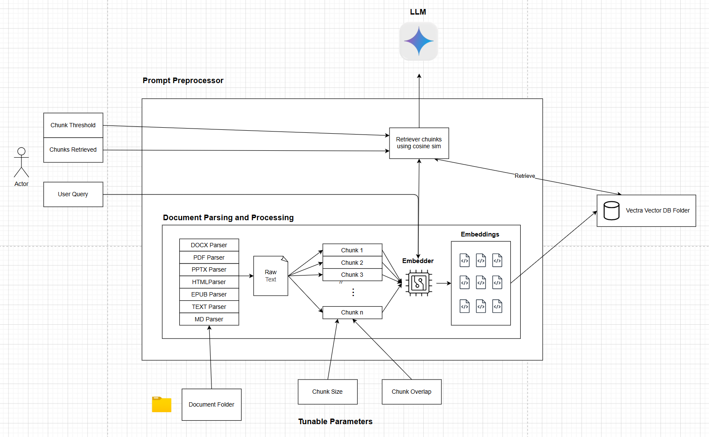

# Legacy Version

Date: 2026-09-15
Status: Reviewed Problems
version: `v1.2.0`

---

## Context
In the deployment of our big rag plugin to be used in processing large amounts of documents, feedback has arrived concerning the accuracy of our plugin when used with the model Gemma E2B. The feedback is particularly related to the extraction of and usage of temporal data. 

This problem in it of itself can have either a single or multiple reasons causing it, including but not limited to 

- Failure to Retrieve Relevant Chunks of Data
- Failure for model to identify these information despite context 
- Insufficient Context for model to process
- Improper chunking, leading to incomplete and loss information 

As of now the Legacy version follows this pipeline

The pipeline employs a rather naive approach to RAG, that uses the basics of what RAG pipeline should contain

- Document Parsing for a variety of document formats
- A simple chunking strategy (Default 512 tokens, 100 token overlap)
- Vector Embedding Based retrieval using Cosine Similarity
- A Vector Database
- Prompt formatting to fit context and user query

---

## Future Plans 
In light of these feedback from our users, we have decided to improve in the existing techniques of our pipeline. Despite the current inplace parameters that could be tuned by our users to hopefully achieve better results such as 

- Chunk size 
- Chunk Overlap 
- Retrieval Threshold

We believe it to be unrealistic to take this approach to resolve the problem due to the following reasons

### Unrecorded Setting Changes
The first reason is recorded setting changes. As of late, the plugin is unable to record the changes that have been made to its hyper parameters, and would likely revert to its original settings. 

This creates a problem and inconvinience to user's who have decided to tune their hyperparameters as they may forget what they have originally set. 

This sets the stage for the need of UI simplification in hyperparameter adjustment all 

### Lack of Awareness
The lack of awareness of their current holding data is also an issue. The reason why our current users are able to hand us feedback regarding missing data is due to how they were likely testing the use of our application with data they already knew. 

However there will likely be a case of a lot of users not knowing about the data beforehand, and it would be unfair to let them tune the parameters or their documents due to this ignorance. 

Hence what we need is to provide them with a more robust system of retrieval along with the new way of "config adjustment" stated earlier

### Potential Overfit to Data
Finally is the potential to overfit to data. Data in the document handling space is rather dynamic in many contexts, and trying your best to obsess over the knobs provided by our existing service can lead to over tuning to a subset of documents instead of its collectivbe hole, especially without proper evaluation guidelines 

Hence it is also our responsibility to prepare and handle an objective point of evaluation for what is the most robust way to filter documents, instead of leaving it to clients to figure out what 'works' for them

---

## Sections of Required Changes
In the idea of making this plugin alot more robust, the update time line can be broken down into 3 different main mile stones. Each consisting of a different part of the pipeline that could potentially boost the performance in accuracy for our solution. These sections are split as:

### Document and Data Preprocessing 
The first and foremost item that would need an improvement. This section consists of multiple important pieces which can affect the pipeline down the road, including 

- Text Formatting 
- Meta Data handling 
- Chunking Strategy

As of now we employ a simple 512 tokens text chunking strategy, with an overlap of 100 tokens. 

How we format the documents can definitely affect the way we process the documents and retrieve them. What meta data we provide can affect the amount of data seen by the model during interpretation. What chunking strategy used can also effect what data is even delivered to the model later on

### Retrieveval Strategy
The next piece is the retrieval strategy. As of now, out service uses a naive way of retrieving documents. The current pipeline consists of a single retreival lane that uses vector embeddings to retrieve relevant documents via Cosine Similarity. 

To improve this, there are different strategies from outside standards that we could adopt to our system. This includes 

- Okapi BM25 Key word matching 
- Hypothetical Documents Embeddings
- Date Filtering or Vote boosting
- Query Expansion using LLMs
- Docuemnt Reranking using LLMs
- Document Reretrieval

We likely plan to include some of these into our existing pipeline for document retrieval. Together with the use of Weight Adjusted Reciprocal Rank Fusion (WARRF) for a more comprehensive retrieval methodology as compared to just vectors

### Summary and Text Compaction
The last piece is what happens to the passages after they are retrieved. Retrieval decides which text is relevant, this section decides how much of it the model is actually able to read.

The limit here is the context window. Gemma E2B gives us roughly 8k tokens, shared between the retrieved passages, the user query, the chat history and the answer itself. At our default of 512 token chunks, five passages already take up around 3k. This is also why summarising a full day or period is hard, as that answer lives in every relevant chunk, not the best five, and no amount of retrieval tuning changes the size of the window.

The options we can consider are

- Contextual chunk headers (done in `v1.3.0`), so a passage carries its own file, date and section instead of needing its neighbours
- Extractive compaction (built, currently off), keeping only the sentences relevant to the query and filling the same budget with more passages
- Parent child retrieval, searching on small chunks but sending the larger section that contains the hit
- Map reduce summarisation, gathering every chunk for a date or document, summarising them in batches that fit the window, then combining
- Sub agent summarisation, handing each batch of documents to its own agent and merging their summaries, which parallelises the work and keeps each agent's context clean
- Model driven reading, giving the model tools to list, read and re search so it decides what to pull in for itself
- Learned prompt compression, which we are not pursuing as it rewrites the text and breaks the link between a citation and the source document

The cheaper options here do not rewrite anything and cost no model calls, so they can stay on the default path. Summarisation, whether map reduce or sub agent based, is slower and lossy by nature, so we plan to scope it to questions that clearly ask for a summary rather than applying it to every query.

These options also cannot be picked on intuition. Compaction and summarisation both remove text, and the failure is silent, the answer still looks complete while a fact has quietly gone missing. Before either is turned on by default, we need a coverage measure in our evaluation harness that scores how much of the relevant content survived into the model's context, not just whether the top passage was correct.
